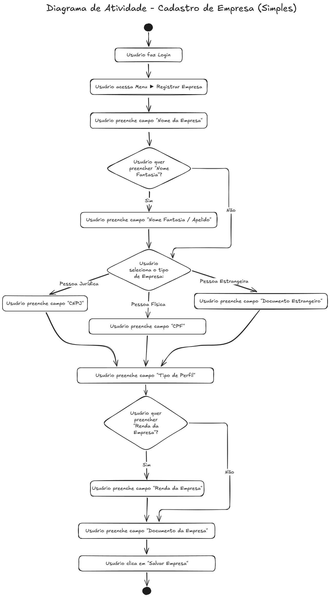
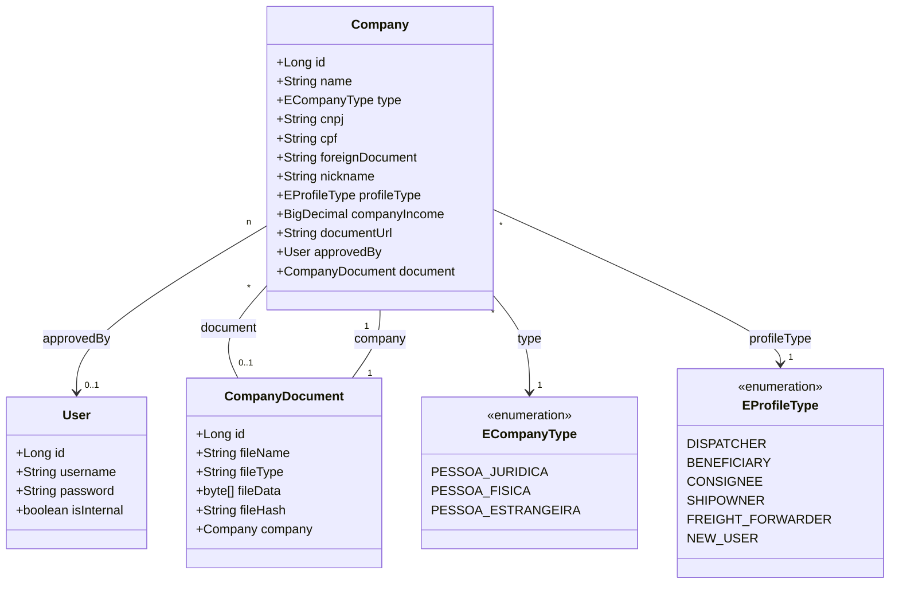

# Diagramas

## Diagrama de Caso de Uso

## Diagrama de Atividade

## Diagrama de Classe

```mermaid
classDiagram
    class Company {
        +Long id
        +String name
        +ECompanyType type
        +String cnpj
        +String cpf
        +String foreignDocument
        +String nickname
        +EProfileType profileType
        +BigDecimal companyIncome
        +String documentUrl
        +User approvedBy
        +CompanyDocument document
    }

    class CompanyDocument {
        +Long id
        +String fileName
        +String fileType
        +byte[] fileData
        +String fileHash
        +Company company
    }

    class User {
        +Long id
        +String username
        +String password
        +boolean isInternal
    }

    class ECompanyType {
        <<enumeration>>
        PESSOA_JURIDICA
        PESSOA_FISICA
        PESSOA_ESTRANGEIRA
    }

    class EProfileType {
        <<enumeration>>
        DISPATCHER
        BENEFICIARY
        CONSIGNEE
        SHIPOWNER
        FREIGHT_FORWARDER
        NEW_USER
    }

    Company "n" --> "0..1" User : approvedBy
    Company "*" -- "0..1" CompanyDocument : document
    Company "*" --> "1" ECompanyType : type
    Company "*" --> "1" EProfileType : profileType
    CompanyDocument "1" -- "1" Company : company
```
